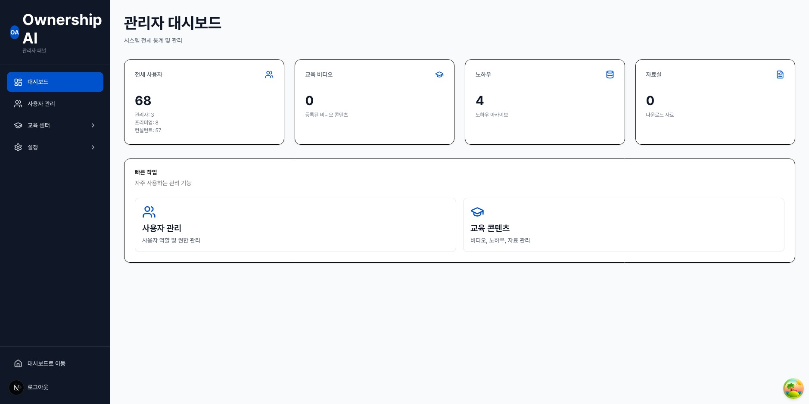

# Ownership AI - 사용자 가이드

> **1인 컨설턴트를 위한 정부지원사업 AI 매칭 플랫폼**

---

## 목차

1. [시작하기](#1-시작하기)
2. [대시보드](#2-대시보드)
3. [고객 관리](#3-고객-관리)
4. [정부지원사업 조회](#4-정부지원사업-조회)
5. [AI 매칭](#5-ai-매칭)
6. [교육 센터](#6-교육-센터)
7. [관리자 기능](#7-관리자-기능)
8. [자주 묻는 질문 (FAQ)](#8-자주-묻는-질문)

---

## 1. 시작하기

### 1.1 회원가입

1. 메인 페이지에서 **"무료로 시작하기"** 버튼 클릭
2. `/auth/signup` 페이지에서 정보 입력
   - 이메일 주소
   - 비밀번호 (8자 이상)
   - 이름, 회사명
3. **"회원가입"** 버튼 클릭
4. 이메일 인증 링크를 통해 계정 활성화

### 1.2 로그인

1. `/auth/login` 페이지에서 이메일/비밀번호 입력
2. 로그인 성공 시 대시보드(`/dashboard`)로 이동

### 1.3 비밀번호 재설정

1. 로그인 페이지에서 **"비밀번호를 잊으셨나요?"** 클릭
2. 이메일 주소 입력 후 재설정 링크 수신
3. 링크를 통해 새 비밀번호 설정

---

## 2. 대시보드

> 경로: `/dashboard`

대시보드는 플랫폼의 핵심 지표와 최근 활동을 한눈에 보여줍니다.

### 2.1 주요 지표 카드

| 지표             | 설명                         |
| ---------------- | ---------------------------- |
| 전체 고객 수     | 등록된 고객 총 수            |
| 전체 프로그램 수 | 수집된 정부지원사업 수       |
| 매칭 실행 수     | 지금까지 실행된 AI 매칭 횟수 |
| 평균 매칭 점수   | 전체 매칭의 평균 적합도      |

### 2.2 차트 및 분석

- **프로그램 출처별 분포**: 중소벤처기업부, K-Startup 등 출처별 프로그램 수
- **트렌드 차트**: 월별 고객/매칭 추이

### 2.3 빠른 액션

- 고객 등록
- 매칭 실행
- 프로그램 검색

### 2.4 PDF 리포트 생성

1. 대시보드 상단 **"리포트 생성"** 버튼 클릭
2. 기간 설정 (시작일 ~ 종료일)
3. **"미리보기"** 로 내용 확인
4. **"PDF 다운로드"** 로 리포트 저장

---

## 3. 고객 관리

> 경로: `/customers`

ERP 스타일의 분할 화면으로 고객 정보를 효율적으로 관리합니다.

### 3.1 화면 구성

| 영역              | 설명                              |
| ----------------- | --------------------------------- |
| **좌측 사이드바** | 고객 목록 (검색, 필터링)          |
| **우측 패널**     | 선택된 고객의 상세 정보 (탭 전환) |

### 3.2 고객 등록

1. 우측 상단 **"고객 등록"** 버튼 클릭 또는 `/customers/new` 이동
2. 필수 정보 입력:
   - **사업자번호** (10자리) - 자동 검증 지원
   - **사업자 유형**: 개인사업자 / 법인사업자
   - **기업명**
   - **업종**
   - **소재지**
3. 선택 정보 입력:
   - 기업 규모, 예산, 키워드
   - 연락처 (이메일, 전화번호)
   - 메모
4. **"등록"** 버튼 클릭

### 3.3 대량 등록 (CSV)

1. `/customers/bulk-upload` 이동
2. **"템플릿 다운로드"** 로 CSV 양식 받기
3. CSV 파일 작성 후 드래그 앤 드롭으로 업로드
4. 미리보기에서 데이터 확인
5. **"업로드"** 버튼으로 일괄 등록

### 3.4 고객 상세 보기 (3개 탭)

#### 기본정보 탭

- 사업자 정보 (사업자번호, 유형, 업종, 소재지)
- 니즈 정보 (키워드, 예산)
- 연락처 정보
- 메모
- 수정/삭제 버튼

#### 매칭 결과 탭

- **AI 매칭**: 매칭 실행 버튼, 매칭 결과 목록 (점수별 정렬)
- **관심목록**: 관심 등록한 프로그램 관리

#### 사업진행현황 탭

- 프로젝트 추가/관리
- 진행 상태 업데이트 (계획, 진행중, 완료, 일시중지)
- 관련 프로그램 연결

### 3.5 고객 검색 및 필터

- **텍스트 검색**: 기업명, 사업자번호로 검색
- **필터 옵션**:
  - 업종별
  - 소재지별
  - 기업 규모별
  - 등록일 기간

---

## 4. 정부지원사업 조회

> 경로: `/programs`

다양한 정부지원사업 정보를 검색하고 관리합니다.

### 4.1 프로그램 목록

- 카드 형태로 프로그램 표시
- 각 카드에 표시되는 정보:
  - 프로그램명
  - 지원 대상
  - 마감일 (D-day 배지)
  - 출처 (중소벤처기업부, K-Startup 등)

### 4.2 검색 및 필터

| 필터            | 설명                       |
| --------------- | -------------------------- |
| **텍스트 검색** | 프로그램명, 설명 내 키워드 |
| **카테고리**    | 사업 분류별 필터           |
| **대상 지역**   | 서울, 경기, 전국 등        |
| **대상 업종**   | 제조업, IT, 서비스업 등    |
| **마감 상태**   | 진행중, 마감임박, 마감     |

### 4.3 프로그램 상세

`/programs/[id]` 페이지에서 확인 가능한 정보:

- 상세 설명
- 지원 자격 및 조건
- 지원 금액/규모
- 신청 기간 및 마감일
- 첨부파일
- 원문 링크
- **관심목록 추가** 버튼 (고객 선택 후 추가)

### 4.4 프로그램 데이터 갱신

관리자 권한이 있을 경우:

- **동기화** 버튼으로 외부 API에서 최신 데이터 수집
- 동기화 상태 확인 (마지막 동기화 시간)

---

## 5. AI 매칭

### 5.1 매칭 실행 방법

1. **고객 관리** 페이지에서 고객 선택
2. **매칭 결과** 탭 클릭
3. **"AI 매칭 실행"** 버튼 클릭
4. 매칭 결과가 점수 순으로 표시됨

### 5.2 매칭 점수 체계

| 항목            | 배점       | 설명                                  |
| --------------- | ---------- | ------------------------------------- |
| **업종 매칭**   | 30점       | 고객 업종과 프로그램 대상 업종 일치   |
| **지역 매칭**   | 30점       | 고객 소재지와 프로그램 대상 지역 일치 |
| **키워드 매칭** | 0~40점     | 고객 키워드와 프로그램 키워드 일치도  |
| **합계**        | 최대 100점 |                                       |

### 5.3 매칭 결과 활용

- 각 결과에서 **매칭 상세 보기**로 점수 상세 확인
- **관심목록에 추가**로 유망 프로그램 저장
- 매칭 이력은 자동 보관

---

## 6. 교육 센터

> 경로: `/education`

컨설팅 역량 강화를 위한 교육 콘텐츠를 제공합니다.

### 6.1 교육 영상

> 경로: `/education/videos`

- 카테고리별 영상 목록 (기초, 실무, 사례 등)
- 영상 재생 (YouTube, Vimeo 지원)
- 조회수 표시
- 태그 기반 관련 영상 탐색
- **관련 자료** 다운로드 (영상에 연결된 자료)

### 6.2 노하우 게시판

> 경로: `/education/knowhow/posts`

- **게시글 목록**: 카테고리별 필터 (업종별, 사업별, 팁, 주의사항)
- **공지사항**: 상단 고정, 공지 배지 표시
- **이벤트**: 시작일/종료일 표시, 이벤트 배지
- **게시글 작성**: 리치 텍스트 에디터 (TipTap) 지원
- **댓글**: 댓글 및 대댓글(답글) 지원
- **조회수**: 자동 카운팅

#### 게시글 작성 방법

1. **"새 글 작성"** 버튼 클릭
2. 카테고리 선택
3. 제목 입력
4. 본문 작성 (서식, 이미지, 링크 지원)
5. **"등록"** 버튼 클릭

### 6.3 노하우 아카이브

> 경로: `/education/knowhow/archive`

- 관리자가 정리한 핵심 노하우 모음
- 댓글 기능 포함

### 6.4 자료실

> 경로: `/education/resources`

- 교육 자료, 템플릿, 체크리스트 다운로드
- **카테고리별** 분류
- **유형별** 분류 (템플릿, 체크리스트, 문서 등)
- 파일명, 크기, 다운로드 횟수 표시
- 검색 기능 지원

---

## 7. 관리자 기능

> 관리자 권한(`admin_panel`)이 있는 사용자만 접근 가능합니다.

### 7.1 관리자 대시보드

> 경로: `/admin`

관리자 페이지에 진입하면 좌측에 **사이드바 네비게이션**, 우측에 **메인 콘텐츠**가 표시됩니다.

#### 사이드바 메뉴 구조

| 메뉴              | 경로                             | 설명                          |
| ----------------- | -------------------------------- | ----------------------------- |
| 대시보드          | `/admin`                         | 관리자 대시보드 (통계 카드)   |
| 사용자 관리       | `/admin/users`                   | 가입 사용자 목록 및 역할 관리 |
| **교육 센터**     |                                  | _하위 메뉴 펼침_              |
| - 비디오 관리     | `/admin/education/videos`        | 교육 영상 CRUD                |
| - 노하우 관리     | `/admin/education/knowhow`       | 게시글/아카이브 관리          |
| - 자료실 관리     | `/admin/education/resources`     | 교육 자료 CRUD                |
| **설정**          |                                  | _하위 메뉴 펼침_              |
| - 연락처 설정     | `/admin/settings/contact`        | 회사/연락처 정보              |
| - 키워드 관리     | `/admin/settings/keywords`       | 매칭 키워드 관리              |
| - 템플릿 관리     | `/admin/settings/copy-templates` | 커뮤니케이션 템플릿           |
| - 랜딩페이지 관리 | `/admin/settings/landing`        | 랜딩페이지 콘텐츠 관리        |

하단에는 **"대시보드로 이동"** 버튼과 **"로그아웃"** 버튼이 있습니다.

#### 대시보드 통계 카드

| 카드        | 표시 내용                                               |
| ----------- | ------------------------------------------------------- |
| 전체 사용자 | 총 사용자 수 + 역할별 분포 (관리자, 프리미엄, 컨설턴트) |
| 교육 영상   | 등록된 영상 수                                          |
| 노하우      | 등록된 노하우 수                                        |
| 자료실      | 등록된 자료 수                                          |

---

### 7.2 사용자 관리

> 경로: `/admin/users`

.JPG>)

#### 사용자 목록 테이블

| 컬럼          | 설명                                                       |
| ------------- | ---------------------------------------------------------- |
| 이름          | 사용자 이름 (미등록 시 "미등록" 표시)                      |
| 이메일        | 가입 이메일                                                |
| 역할          | 배지로 표시 (관리자: 보라, 프리미엄: 노랑, 컨설턴트: 회색) |
| 가입일        | 계정 생성 날짜                                             |
| 마지막 로그인 | 최근 접속 시간                                             |
| 이메일 인증   | "인증됨" 또는 "미인증" 배지                                |
| 작업          | 드롭다운 메뉴                                              |

.JPG>)

#### 필터 기능

- **검색**: 이름 또는 이메일로 검색
- **역할 필터**: 전체 / 관리자 / 프리미엄 / 컨설턴트
- **인증 상태**: 전체 / 인증됨 / 미인증

#### 사용자별 작업 (드롭다운 메뉴)

.JPG>)

| 작업                   | 설명                                            |
| ---------------------- | ----------------------------------------------- |
| **역할 변경**          | 하위 메뉴에서 역할 선택 (현재 역할에 체크 표시) |
| **비밀번호 초기화**    | 해당 사용자의 비밀번호 재설정 이메일 발송       |
| **인증 이메일 재발송** | 미인증 사용자에게만 표시, 인증 이메일 재전송    |
| **계정 삭제**          | 확인 다이얼로그 후 계정 영구 삭제 (주의!)       |

#### 역할 및 권한 체계

| 역할                      | 아이콘 | 주요 권한                                          |
| ------------------------- | ------ | -------------------------------------------------- |
| **관리자** (Admin)        | 방패   | 모든 권한 (관리자 패널, 사용자 관리, 역할 관리 등) |
| **프리미엄** (Premium)    | 별     | 교육 센터, 고객 관리, 매칭, 자료실                 |
| **컨설턴트** (Consultant) | 사용자 | 기본 기능 (고객 관리, 프로그램 조회)               |

**세부 권한 목록:**

| 권한                  | 설명             | 관리자 | 프리미엄 | 컨설턴트 |
| --------------------- | ---------------- | ------ | -------- | -------- |
| `admin_panel`         | 관리자 패널 접근 | O      | X        | X        |
| `user_management`     | 사용자 관리      | O      | X        | X        |
| `role_management`     | 역할 관리        | O      | X        | X        |
| `education_center`    | 교육 센터 접근   | O      | O        | X        |
| `customer_management` | 고객 관리        | O      | O        | O        |
| `program_sync`        | 프로그램 동기화  | O      | X        | X        |
| `matching`            | AI 매칭 실행     | O      | O        | O        |
| `resources`           | 자료실 관리      | O      | O        | X        |

---

### 7.3 교육 콘텐츠 관리

#### 7.3.1 영상 관리

> 경로: `/admin/education/videos`

.JPG>)

**영상 목록 페이지:**

- 상단 통계 카드: 전체 비디오 수, 총 조회수, 카테고리 수
- 카테고리별 통계 테이블
- 영상 목록 (제목, 카테고리, 조회수, 생성일, 수정/삭제)

**영상 추가** - 4단계 폼:

.JPG>)

**1단계: 영상 소스**

| 필드        | 설명                                             |
| ----------- | ------------------------------------------------ |
| 영상 유형   | YouTube / Vimeo / 파일 (드롭다운 선택)           |
| 영상 URL    | 영상 주소 입력                                   |
| 자동 채우기 | YouTube URL 입력 시 제목/설명 자동 가져오기 버튼 |

**2단계: 기본 정보**

| 필드     | 필수 | 설명                    |
| -------- | ---- | ----------------------- |
| 제목     | O    | 영상 제목               |
| 설명     | X    | 영상 설명 (텍스트 영역) |
| 카테고리 | O    | 드롭다운에서 선택       |

**3단계: 추가 정보**

| 필드          | 설명                                    |
| ------------- | --------------------------------------- |
| 썸네일 URL    | 커스텀 썸네일 이미지 주소               |
| 재생시간 (초) | 숫자 입력, YouTube는 자동 가져오기 버튼 |
| 태그          | 쉼표로 구분하여 입력                    |

**4단계: 첨부자료** (신규 등록 시에만)

- 자료 카테고리 선택
- 파일 드래그 앤 드롭 업로드
- 지원 형식: PDF, Word, Excel, PowerPoint, 한글, TXT, ZIP
- 최대 크기: 50MB
- 업로드된 자료는 **자료실에 자동 등록**됩니다

**카테고리 관리:**

.JPG>)

.JPG>)

- 카테고리 추가: 이름, 설명, 정렬 순서 입력
- 카테고리 수정: 연필 아이콘 클릭
- 카테고리 삭제: 휴지통 아이콘 (해당 카테고리에 영상이 있으면 삭제 불가)

---

#### 7.3.2 노하우 관리

> 경로: `/admin/education/knowhow`

.JPG>)

**관리 페이지 구성:**

- 상단 통계 카드: 전체 노하우 수, 총 조회수, 카테고리 수
- 카테고리별 통계 테이블
- **아카이브** 섹션: 관리자가 정리한 핵심 노하우
- **커뮤니티** 섹션: 일반 게시글 목록

**게시글 작성:**

| 필드     | 필수   | 설명                                             |
| -------- | ------ | ------------------------------------------------ |
| 제목     | O      | 게시글 제목                                      |
| 본문     | O      | **리치 텍스트 에디터** (서식, 이미지, 링크 지원) |
| 카테고리 | 조건부 | 일반 게시글은 필수, 공지/이벤트는 선택           |
| 작성자   | X      | 자동 입력 (수동 변경 가능)                       |
| 태그     | X      | 쉼표로 구분                                      |

**카테고리 관리:**

.JPG>)

.JPG>)

---

#### 7.3.3 자료실 관리

> 경로: `/admin/education/resources`

.JPG>)

**관리 페이지 상단 버튼:**

| 버튼          | 설명                     |
| ------------- | ------------------------ |
| 유형 관리     | 자료 유형 추가/수정/삭제 |
| 카테고리 관리 | 자료 카테고리 관리       |
| 자료 추가     | 새 자료 등록             |

**통계 카드 (3개):**

| 카드        | 표시 내용               |
| ----------- | ----------------------- |
| 전체 자료   | 등록된 자료 총 수       |
| 총 다운로드 | 전체 다운로드 횟수 합계 |
| 카테고리    | 카테고리 수 (최대 20개) |

**자료 추가:**

**유형 관리:**

.JPG>)

.JPG>)

- 유형 추가: 이름, 설명, 정렬 순서 입력
- 유형 수정/삭제: 연필/휴지통 아이콘
- 연결된 자료가 있으면 삭제 불가
- 최대 20개 등록 가능

**카테고리 관리:**

.JPG>)

.JPG>)

- 유형 관리와 동일한 인터페이스
- 연결된 자료가 있으면 삭제 불가
- 최대 20개

---

### 7.4 시스템 설정

#### 7.4.1 연락처 및 회사 정보 설정

> 경로: `/admin/settings/contact`

플로팅 버튼과 랜딩페이지 Footer에 표시되는 연락처/회사 정보를 관리합니다.

.JPG>)

아코디언 형태로 3개 섹션이 구성되어 있습니다.

**섹션 1: 회사 소개**

.JPG>)

| 필드        | 설명                                   |
| ----------- | -------------------------------------- |
| 회사명      | 플랫폼에 표시되는 회사 이름            |
| 슬로건      | 회사 소개 모달 및 연락처 모달에 표시   |
| 회사 소개   | 리치 텍스트 에디터 (서식 지원)         |
| 제공 서비스 | 동적 배열 - 서비스 항목 추가/삭제 가능 |

**섹션 2: 연락처 정보**

.JPG>)

| 필드          | 설명                                |
| ------------- | ----------------------------------- |
| 연락처 슬로건 | 연락처 모달 상단에 표시             |
| 전화번호      | 대표 전화번호                       |
| 담당자 목록   | 동적 배열 - 이름, 직함, 이메일 입력 |

담당자는 여러 명 추가할 수 있으며, 각 담당자의 이메일은 필수입니다.

> 여기서 설정한 전화번호와 담당자 정보는 랜딩페이지 Footer의 **문의하기** 영역에도 동일하게 표시됩니다.

**섹션 3: 외부 링크**

.JPG>)

| 필드                | 설명                   |
| ------------------- | ---------------------- |
| 홈페이지 URL        | 회사 홈페이지 주소     |
| 카카오 오픈채팅 URL | 카카오톡 오픈채팅 링크 |

> 이 설정은 플로팅 액션 버튼(FAB)에 반영됩니다. (아래 7.6 참고)

---

#### 7.4.2 키워드 관리

> 경로: `/admin/settings/keywords`

고객 등록 및 AI 매칭에 사용되는 키워드를 체계적으로 관리합니다.

**카테고리 구조:**

- 키워드는 **카테고리**로 그룹핑됩니다
- 각 카테고리에 색상 지정 가능 (빨강, 초록, 파랑, 노랑, 보라, 주황, 회색)

**카테고리 관리:**

| 필드       | 필수 | 설명                                       |
| ---------- | ---- | ------------------------------------------ |
| 카테고리명 | O    | 영문 소문자 + 밑줄 (예: `target_industry`) |
| 표시 이름  | O    | 한글 이름 (예: "대상 업종")                |
| 색상       | O    | 배지 색상 선택 (7가지)                     |

**키워드 관리:**

- 각 카테고리 안에 키워드가 배지 형태로 표시됩니다
- 배지 위에 마우스를 올리면 수정/삭제 아이콘이 나타납니다
- **키워드 추가**: 카테고리의 "키워드 추가" 버튼 클릭
- **키워드 수정**: 배지의 연필 아이콘 클릭
- **키워드 삭제**: 배지의 휴지통 아이콘 클릭
- **활성/비활성**: 키워드별 토글 스위치

---

#### 7.4.3 커뮤니케이션 템플릿

> 경로: `/admin/settings/copy-templates`

고객에게 보내는 메시지를 템플릿으로 관리합니다. 변수를 사용하여 고객별 맞춤 메시지를 자동 생성할 수 있습니다.

.JPG>)

**페이지 상단 버튼:**

| 버튼        | 설명                           |
| ----------- | ------------------------------ |
| 변수 관리   | 템플릿 변수 관리 페이지로 이동 |
| 스니펫 관리 | 스니펫 관리 페이지로 이동      |
| 템플릿 추가 | 새 템플릿 생성                 |

**템플릿 카드 표시:**

- 템플릿 이름 + 파일 아이콘
- 배지: 기본 템플릿(별), 비활성(눈 아이콘), 용도 구분
- 설명
- 미리보기 버튼 (접기/펼치기)
- 수정 / 삭제 버튼

.JPG>)

.JPG>)

**템플릿 생성/수정 폼:**

| 필드        | 필수 | 설명                              |
| ----------- | ---- | --------------------------------- |
| 템플릿 이름 | O    | 식별용 이름                       |
| 설명        | X    | 템플릿 용도 설명                  |
| 정렬 순서   | X    | 표시 순서                         |
| 사용 대상   | O    | 고객용 / 내부용 / 전체 (드롭다운) |
| 헤더 템플릿 | X    | 메시지 상단 (변수 자동완성 지원)  |
| 본문 템플릿 | O    | 프로그램별 반복되는 본문          |
| 푸터 템플릿 | X    | 메시지 하단                       |
| 기본 템플릿 | X    | 기본값 사용 여부 토글             |
| 활성 상태   | X    | 사용 여부 토글                    |

**변수 자동완성:**

- 텍스트 입력 중 `{{`를 입력하면 사용 가능한 변수 목록이 표시됩니다
- 예: `{{customerName}}`, `{{totalCount}}`, `{{index}}`

**변수 관리:**

.JPG>)

.JPG>)

- **시스템 변수** (읽기 전용): 자물쇠 아이콘, 삭제/수정 불가
- **사용자 정의 변수**: 자유롭게 추가/수정/삭제 가능

**스니펫 관리:**

.JPG>)

.JPG>)

| 카테고리 | 배지 색상 | 용도             |
| -------- | --------- | ---------------- |
| 인사말   | 초록      | 메시지 시작 인사 |
| 마무리   | 파랑      | 메시지 종료 문구 |
| 알림     | 노랑      | 알림/안내 문구   |
| 기타     | 회색      | 기타 문구        |

---

#### 7.4.4 랜딩페이지 관리

> 경로: `/admin/settings/landing`

랜딩페이지(메인 페이지)에 표시되는 콘텐츠를 관리합니다.

.JPG>)

아코디언 형태로 6개 섹션이 구성되어 있습니다.

**Hero 설정**

.JPG>)

- 배지 텍스트: 히어로 섹션 하단에 표시되는 안내 문구 (예: "베타 서비스 운영 중")

**신뢰 지표**

.JPG>)

- 후기 섹션 하단에 표시되는 수치 지표
- 수치와 라벨 쌍으로 관리 (예: "100+" / "베타 테스터")
- 지표 추가/삭제 가능

**FAQ 관리**

.JPG>)

- 자주 묻는 질문을 추가/수정/삭제
- 각 FAQ 항목에 활성화/비활성화 토글
- 비활성화된 항목은 랜딩페이지에 표시되지 않음

**후기 관리**

- 베타 테스터 후기를 추가/수정/삭제
- 이름, 직함, 회사명, 후기 내용 입력
- 활성화/비활성화 토글

**약관 관리**

.JPG>)

- **개인정보 처리방침**: `/privacy` 페이지에 표시될 내용 (리치 텍스트 에디터)
- **이용약관**: `/terms` 페이지에 표시될 내용 (리치 텍스트 에디터)

**Footer 설정**

.JPG>)

| 필드                        | 설명                                                       |
| --------------------------- | ---------------------------------------------------------- |
| 회사명                      | Footer에 표시되는 회사명                                   |
| 설명                        | 회사 한 줄 소개                                            |
| 문의하기 (전화번호, 담당자) | 연락처 설정 페이지와 동일한 데이터 사용 (링크로 이동 안내) |

---

### 7.5 통계 및 리포트

#### 관리자 대시보드 통계

- 전체 사용자 수 및 역할별 분포
- 교육 콘텐츠 현황 (영상, 게시글, 자료 수)

#### 자료실 통계 (관리자 자료실 페이지)

- 전체 자료 수 / 총 다운로드 수 / 카테고리 수
- 카테고리별 상세: 자료 수, 다운로드 수, 평균 다운로드

#### 대시보드 리포트 (메인 대시보드)

- 기간별 종합 리포트 PDF 생성
- 고객별 상세 리포트 PDF 생성
- 미리보기 후 다운로드

---

### 7.6 플로팅 액션 버튼 (FAB)

화면 우측 하단에 항상 표시되는 파란색 원형 버튼입니다. 클릭하면 4개의 메뉴가 애니메이션과 함께 나타납니다.

| 메뉴      | 아이콘 | 동작                       |
| --------- | ------ | -------------------------- |
| 회사 소개 | 빌딩   | 회사 소개 모달 열기        |
| 문의하기  | 전화   | 연락처 모달 열기           |
| 홈페이지  | 지구본 | 외부 홈페이지 새 탭 열기   |
| 카카오톡  | 메시지 | 카카오 오픈채팅 새 탭 열기 |

> 홈페이지, 카카오톡 메뉴는 관리자 설정(`/admin/settings/contact`)에서 URL을 등록한 경우에만 표시됩니다.

**회사 소개 모달:**

- 회사명 + 슬로건
- 회사 소개 본문 (HTML 렌더링)
- 제공 서비스 목록 (체크 아이콘)
- "문의하기" 버튼 (연락처 모달로 전환)

**연락처 모달:**

- 슬로건
- 대표 전화번호 (클릭 시 전화 연결)
- 담당자별 이름, 직함, 이메일 (클릭 시 메일 작성)

---

## 8. 자주 묻는 질문

### Q. 매칭 점수는 어떻게 계산되나요?

업종(30점), 지역(30점), 키워드(최대 40점)의 합산으로 계산됩니다. 키워드는 고객의 등록 키워드와 프로그램의 키워드 일치도에 따라 비례 배점됩니다.

### Q. 프로그램 데이터는 얼마나 자주 업데이트되나요?

외부 API(중소벤처기업부, K-Startup 등)에서 매일 오전 9시(KST)에 자동 동기화됩니다. 관리자가 수동으로 동기화를 실행할 수도 있습니다.

### Q. 자료실에서 다운로드한 파일은 어디에 저장되나요?

브라우저의 기본 다운로드 경로에 저장됩니다. 다운로드 횟수는 자동으로 카운트됩니다.

### Q. 교육 센터에 접근이 안 됩니다.

교육 센터는 `education_center` 권한이 필요합니다. 관리자에게 권한 부여를 요청하세요.

### Q. CSV 대량 업로드 시 오류가 발생합니다.

- 템플릿을 다운로드하여 형식에 맞게 작성했는지 확인하세요
- 사업자번호는 10자리 숫자여야 합니다
- 필수 필드(기업명, 업종, 소재지)가 비어있지 않은지 확인하세요

### Q. 관리자 권한은 어떻게 얻나요?

기존 관리자가 `/admin/users`에서 역할을 부여해야 합니다.

---

> **문의**: 플랫폼 사용 중 문제가 발생하면 관리자에게 문의하거나, 플랫폼 내 문의 기능을 이용해주세요.
